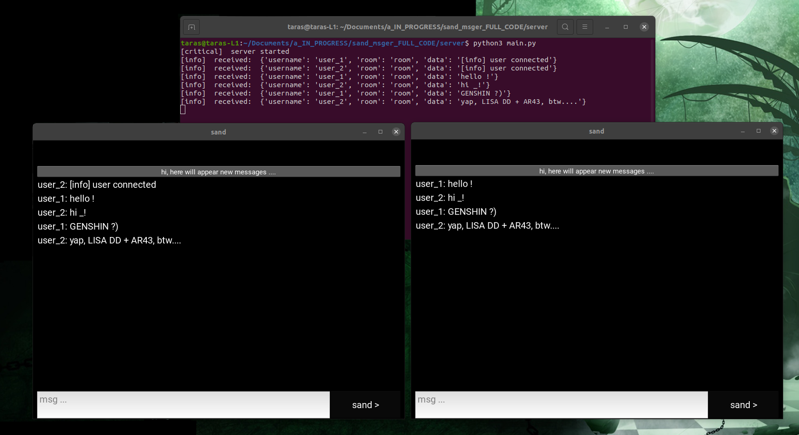

# SAND (пісок) месенджер



## 🤨 Навіщо ?:
для анонімних швидких переговорів.

## 🤓 Опис:
месенджер в стилі хакерів із фільмів і також для анонімних швидких переговорів, швидкий, легкий і атмосферний.

## ☠️ Використані технології:
- все написано на PYTHON
- GUI на KIVY
- під капотом MQTT

## 🌱 Структура проекта:
- `screenshots/` — непотрібна для роботи програми, зберігаються лише скраншоти роботи програми
- `server/` — ісходніки для сервера
- `client/` — ісходніки для клієнта

## 😎 Як це запустити ?:
1. встановлюємо необхідні пакети
```bash
sudo apt update
sudo apt install python3
sudo apt install python3-pip python3-dev libsdl2-dev libsdl2-image-dev libsdl2-mixer-dev libsdl2-ttf-dev libportmidi-dev libswscale-dev libavformat-dev libavcodec-dev zlib1g-dev libgstreamer1.0-0 gstreamer1.0-plugins-base gstreamer1.0-plugins-good
pip install "kivy[base]"
python3 -m pip install --upgrade pip
pip3 install paho-mqtt
```
2. запускаємо сервер
```bash
python3 main.py
```
2. запускаємо клієнтів
```bash
python3 main.py
```

## ❓ Швидкі питання і відповіді
1. "працює по локалкі чи глобальньній мережі ?" - "тут в мене на локалкі. але цей код може також працювати і на глобальній мережі"
